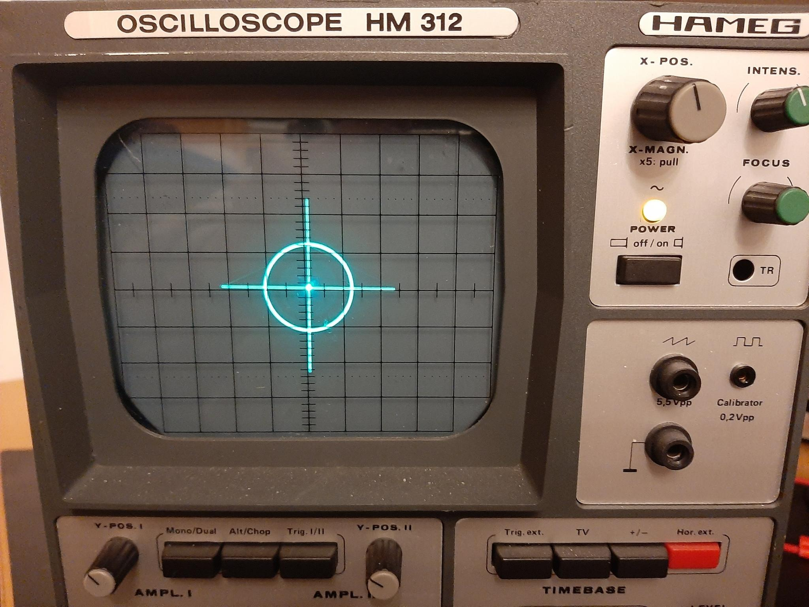

# Oscilloscope Drawing

A device that draws on an oscilloscope.

## Introduction
Drawing on analog oscilloscope is almost a classic in the electronics/microcontroller community now.
This is done by setting the scope to XY-Mode and then controlling the X/Y-deflection of the electron-beam.

This Project is my shot at this. I use custom hardware (build on perf-board) to archive this goal. I have build
a 2-Channel 16bit DAC with an refresh rate of around 1 MSample per second.

  
  

### Hardware

I'm using an [Raspberry Pico](https://www.raspberrypi.com/products/raspberry-pi-pico/) (Code is written in C/C++ with the [PicoSDK](https://www.raspberrypi.com/documentation/pico-sdk/)). 
The [rp2040](https://www.raspberrypi.com/documentation/microcontrollers/rp2040.html)'s PIO cores are used to archive higher data rate. 

The DAC is a R-2R-Ladder DAC on a custom PCB. The Input-Bits are feed from Octal-D-Latches ([74HC573](https://www.reichelt.de/oktal-d-type-latch-3-state-2--6-v-dil-20-74hc-573-p3264.html?search=74HC573)) in combination with some other logic ICs to reduce pin usage on the RPi Pico. Data sent via a 8-bit a parallel Bus to

At 1 MHz Square Wave, the analog output signal quality is significantly degraded. Testing revealed that probably R-2R_Ladder DAC is the weak link and needs further improvement. I currently use R = 11kOhm.

Yellow: X-Channel, Blue: Y-Channel, Magenta: Digital Input Signal to the DAC. (Yellow and Blue are coupled to AC, they usually to remove the 2.5V offset)

Everything is solder onto pref-boards an connected via pin-headers and jumpers

For testing the optics I did use a Hameg MH 312 Oscilloscope (I got this one used from Kleinanzeigen, so its already falling apart: semi-broken Coupling-switch, not being able focus the beam correctly, X-Pos know falling off all the time)

